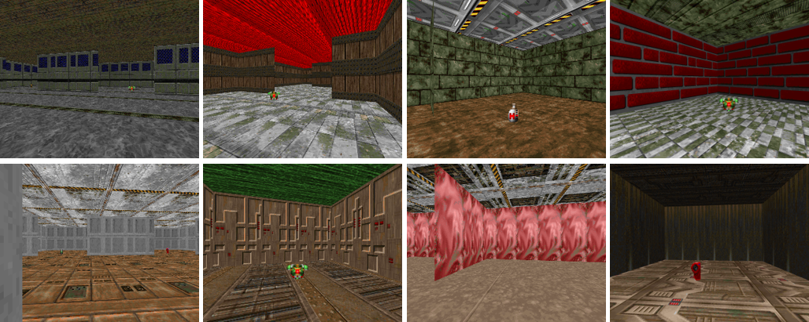

# Multi-target Visual Navigation
This repository contains [ViZDoom](https://github.com/mwydmuch/ViZDoom)-based multi-target navigation environments used in our NeurIPS21 paper ["Goal-Aware Cross-Entropy for Multi-Target Reinforcement Learning"](https://arxiv.org/abs/2110.12985).



## Installation
This build has been confirmed to run on below system and libraries:
- Ubuntu 18.04+
- Python 3.8.10 (via conda)
- vizdoom 1.1.9
- opencv-python 4.5.5

First, using Conda ([installation instructions](https://docs.conda.io/projects/conda/en/latest/user-guide/install/index.html)), a new virtual environment can be created. Virtual environment helps manage dependencies, as well as keep dependencies isolated from other installed modules.
```
conda create -n multitarget-visnav python==3.8.10
conda activate multitarget-visnav
```

ViZDoom can be installed as below (For additional details, please refer to [building instructions for ViZDoom](https://github.com/mwydmuch/ViZDoom/blob/master/doc/Building.md)):
```
sudo apt-get update
sudo apt-get install build-essential zlib1g-dev libsdl2-dev libjpeg-dev nasm tar libbz2-dev libgtk2.0-dev cmake git libfluidsynth-dev libgme-dev libopenal-dev timidity libwildmidi-dev unzip
sudo apt-get install libboost-all-dev
pip install numpy
pip install vizdoom==1.1.9     # 1.1.10 doesn't seem to work yet on Ubuntu 18.04
```

OpenCV3 can be installed as below:
```
pip install opencv-python
```

Finally, this repository can be installed as below:
```
git clone https://github.com/lionminhu/multitarget-visnav.git
cd multitarget-visnav
pip install -e .
```

## Available Maps
Below maps were used for the experiments in the paper:
- `multitarget-visnav-exp1-v1` (**V1**): A rectangular room enclosed with walls. Four objects are placed, one of which is randomly specified as the goal object. The positions of the objects are randomized every episode.
- `multitarget-visnav-exp2-seen-v1` (**V2 seen**): Identical to V1, except with randomized background textures.
- `multitarget-visnav-exp2-unseen-v1` (**V2 unseen**): Identical to V1, except with randomized background textures that are not used in V2 seen.
- `multitarget-visnav-exp3-v1` (**V3**): Maze-like environment with additional walls. The object positions are predefined, but which object is placed in those positions is shuffled.
- `multitarget-visnav-exp4-seen-v1` (**V4 seen**): V3 with randomized background textures.
- `multitarget-visnav-exp4-unseen-v1` (**V4 unseen**): V3 with randomized background textures not used in V4 seen.


## Example
```
import gym
import multitarget-visnav
env = gym.make('multitarget-visnav-exp1-v1')

# New episode
env.reset()

# Possible actions: 0 - move forward, 1 - rotate left, 2 - rotate right
env.step(0)
```

Run `python3 maze_interactive.py` for an interactive play of the environment. The controls are:
- 1: Move forward
- 2: Rotate left
- 3: Rotate right
- r: Reset, start a new episode
- s: Take a screenshot, which will be saved in `interactive_img` directory.
- q: Quit


## Notes

The codes are modified versions of `microsoft/MazeExplorer` repository ([link](https://github.com/microsoft/MazeExplorer)) and `lionminhu/maze_env` repository ([link](https://github.com/lionminhu/maze_env)).

If you wish to cite this environment, please consider using the below BibTeX for reference:
```
@article{kim2021goal,
  title={Goal-Aware Cross-Entropy for Multi-Target Reinforcement Learning},
  author={Kim, Kibeom and Lee, Min Whoo and Kim, Yoonsung and Ryu, JeHwan and Lee, Minsu and Zhang, Byoung-Tak},
  journal={Advances in Neural Information Processing Systems},
  volume={34},
  year={2021}
}

@article{wydmuch2018vizdoom,
  title={ViZDoom Competitions: Playing Doom from Pixels},
  author={Wydmuch, Marek and Kempka, Micha{\l} and Ja{\'s}kowski, Wojciech},
  journal={IEEE Transactions on Games},
  year={2018},
  publisher={IEEE}
}
```
